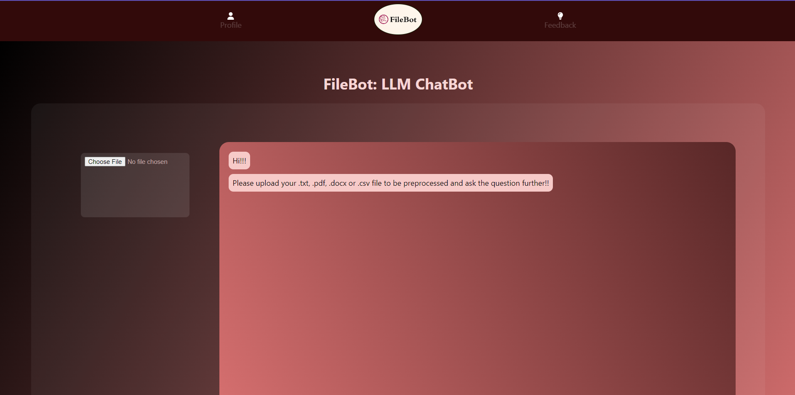
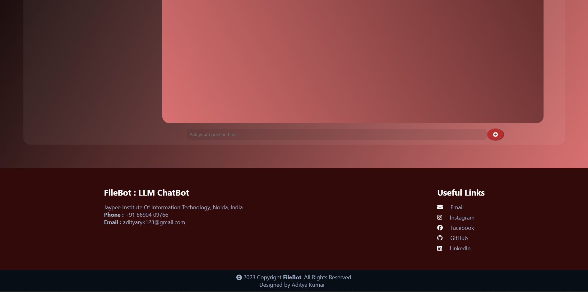

# FileBot: LLM ChatBot

Welcome to FileBot, your AI-powered ChatBot designed to assist you with file preprocessing and answering questions related to your documents. Whether you have a PDF, DOCX, CSV, or TXT file, FileBot is here to help!

## Demo Video

## Overview

FileBot leverages Natural Language Processing (NLP) techniques to extract information from your uploaded files and answer questions based on the content. The frontend is built using React, while the backend is powered by FastAPI, providing a seamless user experience and efficient processing.

## How it Works

1. **Upload File**: Choose your file (PDF, DOCX, CSV, or TXT) containing the information you want to analyze.
2. **Ask Question**: Enter your question related to the document content.
3. **Get Answer**: FileBot processes your question and provides relevant answers extracted from the uploaded file.

## Tech Stack

- **Frontend**: React, TypeScript
- **Backend**: FastAPI
- **NLP Libraries**: NLTK, Scikit-learn
- **File Processing**: Pandas, PyMuPDF, python-docx

## Installation and Setup

1. Clone this repository to your local machine.
2. Navigate to the backend directory.
3. Install dependencies using `pip install -r requirements.txt`.
4. Run the frontend and backend servers.
5. Start interacting with FileBot!

## Commands

- To install backend dependencies: `pip install -r requirements.txt`
- To start the frontend server: `npm start`
- To start the backend server: `uvicorn main:app --reload`

## Screenshots

## Feedback

We welcome your feedback! If you have any suggestions or encounter any issues, please feel free to [open an issue](https://github.com/yourusername/FileBot/issues) on GitHub.

## Acknowledgments

FileBot was developed by Aditya Kumar as a project for LLM Assignment. 

---

Copyright © 2024 FileBot. All rights reserved.
